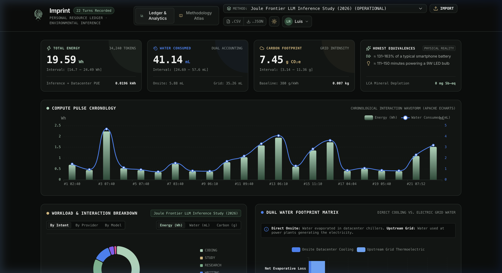
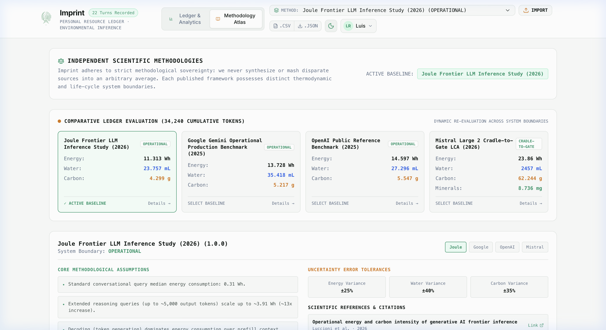
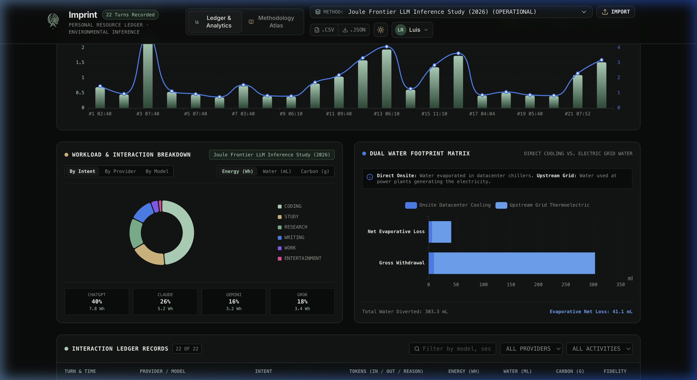

# Imprint — Make your AI footprint visible

<div align="center">
  
  <h1>Imprint</h1>
  <p><strong>Personal Computational Resource Ledger · Environmental Inference</strong></p>
  <p><em>Translating AI browser interactions into transparent, science-grounded physical accounts of energy, water, and carbon.</em></p>
</div>

[](LICENSE)
[](https://www.typescriptlang.org/)
[](https://turbo.build/)
[](https://nextjs.org/)
[](https://wxt.dev/)

---

## 1. Visual Overview & Laboratory Interface

### Laboratory Dark Mode


### Scientific Light Mode (CodeCarbon-inspired)


### Multidimensional Workload & Dual Water Footprint Matrix


---

## 2. Product Thesis & Core Principles

Artificial intelligence is frequently treated as an abstract software utility. In reality, each token generated triggers physical energy conversion in silicon, evaporative cooling in datacenters, and grid transmission losses.

**Imprint** bridges browser interactions to physical reality through four core pillars:

1. **Strict Zero-Prompt Storage & Privacy**:
   No prompt text, questions, or assistant answers are ever stored, transmitted, or logged. The browser extension measures only statistical lengths (character counts and word counts) directly within the DOM.
2. **Sovereign Scientific Methodologies**:
   Imprint refuses to synthesize or blend disparate sources into an artificial average. Each peer-reviewed benchmark (`Google-Operational-2025`, `Joule-Frontier-2026`, `Mistral-LCA-2026`, `OpenAI-Reference-2025`) is modeled as a sovereign, versioned entity with its own system boundaries and error margins ($\pm\%$).
3. **Dual Water Accounting**:
   Distinguishes **Water Consumed** (evaporative loss permanently removed from the immediate watershed) from **Water Withdrawn** (gross water diverted, of which the non-evaporated fraction returns), as well as **Onsite Datacenter Cooling** vs. **Upstream Grid Thermoelectric Generation**.
4. **Editorial & Scientific Laboratory Aesthetics**:
   Dual Dark (`#0B0D0C`) and Light (`#F8FAF8`) modes inspired by CodeCarbon, featuring mineral green (`#A8D5BA`) for physical resources, warm amber (`#D8B878`) for observational uncertainty, high-contrast monospace telemetry, and the **Biometric Circuit Mark**.

---

## 3. Monorepo Architecture

```text
                                IMPRINT MONOREPO
                                       │
        ┌──────────────────────────────┼──────────────────────────────┐
        │                              │                              │
      APPS                          PACKAGES                       SHARED
        │                              │                              │
  ┌─────┴────────┐             ┌───────┴────────┐                     │
  ▼              ▼             ▼                ▼                     ▼
extension       web         schemas       impact-engine           tsconfig
(Manifest V3) (Next.js)   (Zod Types)   (Pure Math Engine)    (Shared Config)
  │              │             ▲                ▲
  └──────────────┼─────────────┴────────────────┤
                 ▼                              │
         provider-adapters ─────────────────────┘
       (ChatGPT, Claude, Gemini, Grok)
```

### Workspace Packages

| Path | Name | Description |
| :--- | :--- | :--- |
| `packages/schemas` | `@imprint/schemas` | Zod validation schemas, data provenance, impact scopes, and ledger contracts. |
| `packages/impact-engine` | `@imprint/impact-engine` | Deterministic computation engine, peer-reviewed methodology registry, and physical equivalences. |
| `packages/provider-adapters` | `@imprint/provider-adapters` | Universal registry and DOM observers for ChatGPT, Claude, Gemini, and Grok. |
| `apps/extension` | `@imprint/extension` | Manifest V3 browser extension built with WXT, React 19, and Tailwind CSS. |
| `apps/web` | `@imprint/web` | Next.js 15 analytics dashboard with interactive Apache ECharts visualizations. |
| `apps/api` | `@imprint/api` | Cloud synchronization API with Hono, Neon PostgreSQL schema, and Better Auth. |

---

## 4. How to Run & Use Imprint

### Prerequisites
- **Node.js**: v20.x or v22.x
- **pnpm**: v9.x or v11.x

```bash
# Clone the repository
git clone https://github.com/luisrodriguez-rgb/Imprint.git
cd Imprint

# Install all workspace dependencies
pnpm install
```

---

### Option A: Web Analytics Dashboard (`apps/web`)

The Web Dashboard allows you to explore historical telemetry, analyze compute pulses over time, view dual water accounting, inspect all four scientific methodologies, and import data from the extension or database.

```bash
# Start the web dashboard dev server
pnpm --filter @imprint/web dev
```

Open **[http://localhost:3005](http://localhost:3005)** in your browser.

**Key Dashboard Capabilities:**
- **Hero Metrics**: Total energy in $\text{Wh}$ and $\text{kWh}$, dual water accounting, carbon footprint, and physical reality equivalences.
- **Compute Pulse Chronology**: Interactive Apache ECharts waveform showing turn-by-turn energy and water spikes with reasoning model highlights.
- **Multidimensional Workload Breakdown**: Filter energy, water, or carbon by intent (`CODING`, `RESEARCH`, `STUDY`, `WRITING`, `WORK`, `ENTERTAINMENT`), AI provider, or model family.
- **Dual Water Footprint Matrix**: Non-truncated, labeled breakdown of direct onsite datacenter cooling vs. upstream thermoelectric grid generation.
- **Methodology Atlas**: Side-by-side comparative matrix recalculating all tokens across all 4 independent benchmarks.
- **Dark & Light Mode**: Toggle instantly between laboratory black (`#0B0D0C`) and scientific crisp white (`#F8FAF8`).
- **Robust JSON Import**: Ingest telemetry from the browser extension or database backups with automatic token reconstruction, model inference, and data normalization.

---

### Option B: Build and Load the Browser Extension (`apps/extension`)

The extension observes interactions in real time on **ChatGPT**, **Claude**, **Gemini**, and **Grok** with zero prompt text storage.

```bash
# Build the Manifest V3 extension bundle
pnpm --filter @imprint/extension build
```

The production extension will be compiled to:
`apps/extension/.output/chrome-mv3`

#### How to load in Chrome / Brave / Edge:
1. Open your browser and navigate to `chrome://extensions` (or `brave://extensions`).
2. Toggle **Developer mode** in the top-right corner.
3. Click **Load unpacked** in the top-left corner.
4. Select the directory:
   `apps/extension/.output/chrome-mv3`
5. Pin the **Imprint** icon to your browser toolbar.

#### How to test live:
- Visit **[ChatGPT](https://chatgpt.com)**, **[Claude](https://claude.ai)**, **[Gemini](https://gemini.google.com)**, or **[Grok](https://grok.com)**.
- Send any prompt. Once the response completes, Imprint will automatically record statistical lengths and compute physical impacts.
- Click the Imprint toolbar icon to inspect:
  - Total Energy ($\text{Wh}$) and Water ($\text{mL}$).
  - **The Imprint Line**: Click individual turns to see their exact energy profile.
  - **Provider Simulator**: Click `[RECORD CLAUDE TURN (+1)]` to simulate interactions without opening a chat session.
  - **Export**: Click `.CSV` or `.JSON` in the footer to download your ledger.

---

### Option C: Transferring Data from Extension to Web Dashboard

1. In the extension popup, click **`.JSON`** in the footer to save `imprint-ledger-YYYY-MM-DD.json`.
2. Open the Web Dashboard at **`http://localhost:3005`**.
3. Click **`IMPORT`** in the top navigation bar.
4. Select or paste your `.json` file.
5. Review the verification report (total tokens, provider split, applied methodology).
6. Choose to **Append to Existing** or **Replace Ledger**.

---

## 5. Scientific Literature & Methodology Citations

- **`[JOULE 2026]`**: Luccioni et al., *Powering Frontier Reasoning Models: Empirical Energy Bounds of Test-Time Compute Scaling*, Joule / Cell Press, 2026.
- **`[GOOGLE 2025]`**: Google Environmental Report, *Operational Datacenter Energy and Direct Evaporative Water Metrics per User Prompt*, Google LLC, 2025.
- **`[MISTRAL 2026]`**: Mistral AI & Quantis, *Life Cycle Assessment of Large Language Models: Cradle-to-Gate Water and Mineral Resource Depletion*, Mistral Research, 2026.
- **`[OPENAI 2025]`**: OpenAI Public Disclosures, *Reference Operational Inference Bounds and Empirical Power Draw*, OpenAI Inc., 2025.

---

## 6. Running Quality Checks

```bash
# Typecheck across all monorepo packages
pnpm run check-types

# Run unit tests across all packages (42 passing tests)
pnpm test
```

---

## License

MIT © 2026 Imprint Contributors.
